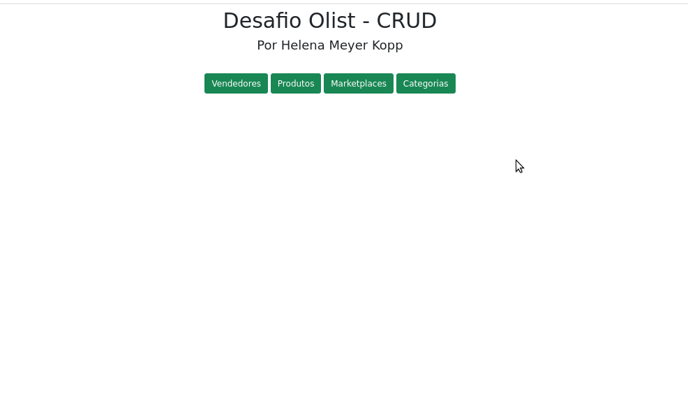
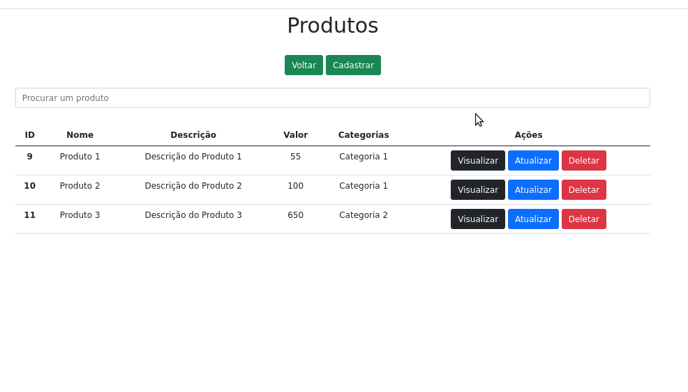
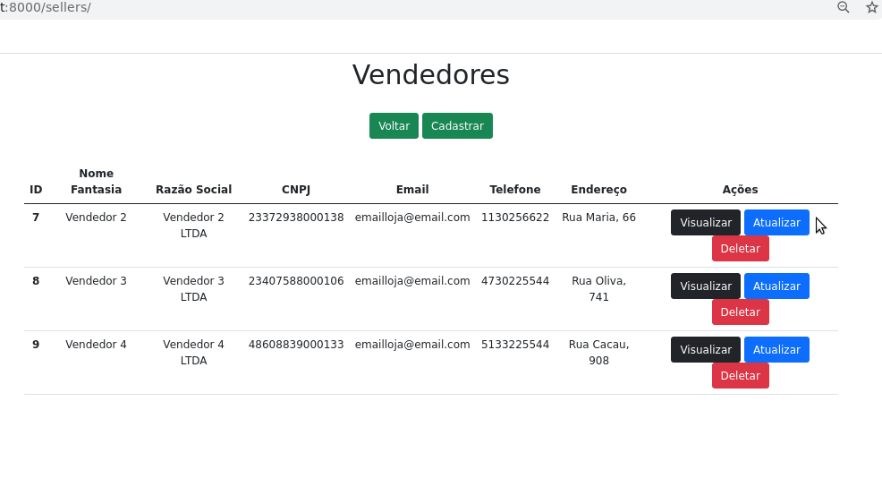

#  Desafio Técnico Olist 

## Descrição
Desenvolvimento de um aplicativo para armazenar dados de vendedores, categorias, marketplaces e produtos.

O sistema permite a leitura, criação, edição e exclusão de dados (CRUD);

Para esse projeto, foi escolhida a linguagem Python3, Pycharm utilizado como IDE, Banco de Dados sqlite e o framework de desenvolvimento web Django.

Também foi criada uma máquina virtual, fazendo com que tudo que fosse instalado ficasse restrito apenas ao projeto e não ficasse disponível de forma global.


## Índice
- [Requisitos](#Requisitos)
- [Instalação](#Instalação)
- [Uso](#Uso)
- [Imagens](#Imagens)


## Requisitos
Para rodar o programa, você deverá ter instalado na sua máquina o python3, o banco de dados sqlite e o django. 

## Instalação
- Antes de qualquer coisa, devemos utilizar o seguinte comando:
    ``` 
  sudo apt-get update
  ```

- Python3
  ``` 
  sudo apt install python3.8
  ```
- Sqlite
    ```
    sudo apt-get install sqlite3
    ```
- Django
   ```
    pip install Django
    ```


## Uso
Para rodar a aplicação:
- Clonar o repositório;
- Acessando a pasta do projeto, iniciar a máquina virtual com o seguinte comando:
```
. env3/bin/activate
```
- Com a máquina virtual ativada, devemos ligar o servidor com o seguinte comando:
```
python manage.py runserver
```
- No navegador, através do endereço localhost:8000 (padrão do Python), acessamos o projeto.


## Imagens
- Para um melhor entendimento, abaixo, temos alguns gifs breves de exemplo do projeto funcionando.


- Página inicial e menus: 

  


- Página de produtos. Exclusão - Atualização e Busca: 

  


- Página de vendedor. Adição de um novo registro: 

  


